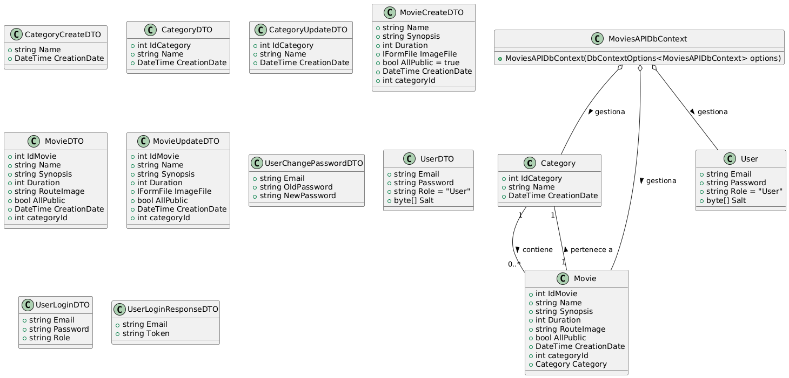
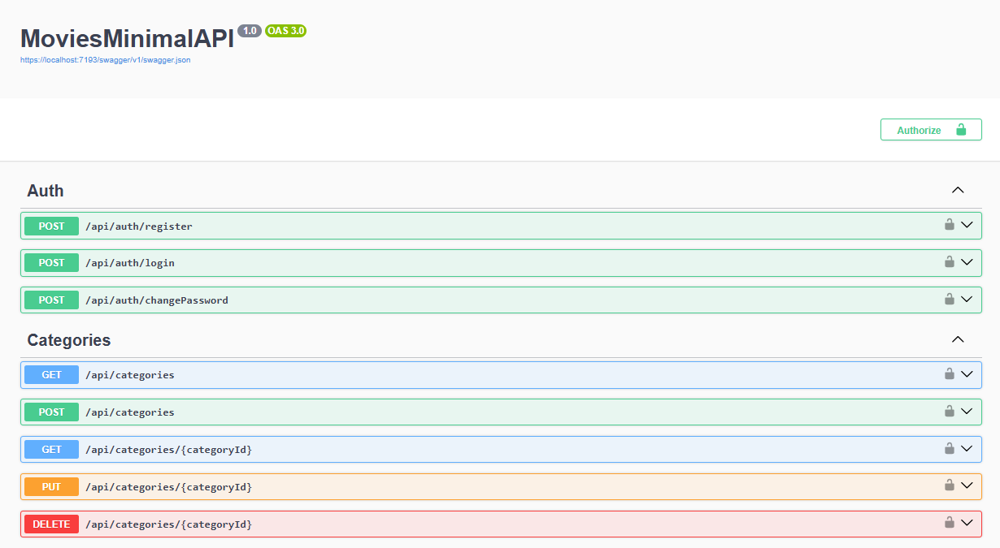
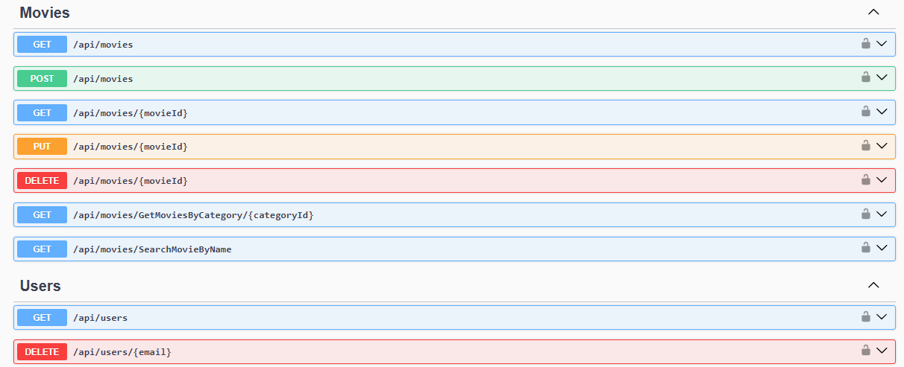
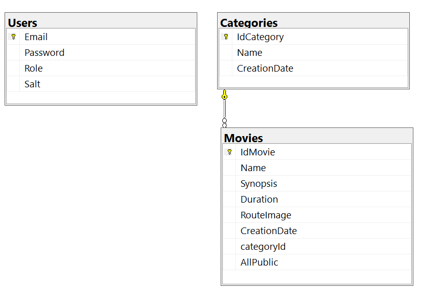

## MoviesMinimalAPI

**MoviesMinimalAPI** is an ASP.NET Core Web API project for managing movie and category-related information, including functionality for user management and authentication/authorization. Models represent database entities, such as Category, Movie, and User. DTOs are the objects used for data transfer between layers, with specific DTOs for creating, updating, viewing, and authenticating categories, movies, and users. Repositories encapsulate data access logic for entities. Services contain business logic and orchestrate operations, interacting with repositories and other functionality such as file management and password hashing. Validators use FluentValidation to validate input DTOs, ensuring that the data meets certain criteria. Mappers use AutoMapper to map objects between models and DTOs. They define endpoints using ASP.NET Core Minimal API functionality for categories, movies, and authentication/users.



MoviesMinimalAPI/  
├───Classes/  
│   ├───HashResult.cs  
│   └───ImageFileOperationFilter.cs  
├───DTOs/  
│   ├───CategoryCreateDTO.cs  
│   ├───CategoryDTO.cs  
│   ├───CategoryUpdateDTO.cs  
│   ├───MovieCreateDTO.cs  
│   ├───MovieDTO.cs  
│   ├───MovieUpdateDTO.cs  
│   ├───UserChangePasswordDTO.cs  
│   ├───UserDTO.cs  
│   ├───UserLoginDTO.cs  
│   ├───UserLoginResponseDTO.cs  
│   └───UserRegistrationDTO.cs  
├───Models/  
│   ├───APIResponses.cs  
│   ├───Category.cs  
│   ├───Movie.cs  
│   ├───MoviesMinimalAPIDbContext.cs  
│   └───User.cs  
├───MoviesMappers/  
│   └───MoviesMapper.cs  
├───Repository/  
│   ├───CategoryRepository.cs  
│   ├───ICategoryRepository.cs  
│   ├───IMovieRepository.cs  
│   ├───IRepository.cs  
│   ├───IUserRepository.cs  
│   ├───MovieRepository.cs  
│   └───UserRepository.cs  
├───Services/  
│   ├───CategoryService.cs  
│   ├───FileManagerService.cs  
│   ├───HashService.cs  
│   ├───ICategoryService.cs  
│   ├───IFileManagerService.cs  
│   ├───IMovieService.cs  
│   ├───IService.cs  
│   ├───ITokenService.cs  
│   ├───IUserService.cs  
│   ├───MovieService.cs  
│   ├───TokenService.cs  
│   └───UserService.cs  
├───Validators/  
│   ├───MovieCreateDTOValidator.cs  
│   ├───MovieUpdateDTOValidator.cs  
│   ├───UserChangePasswordDTOValidator.cs  
│   ├───UserLoginDTOValidator.cs  
│   └───UserRegistrationDTOValidator.cs  
├───appsettings.json  
└───Program.cs  





## Program
```cs
builder.Services.AddDbContext<MoviesMinimalAPIDbContext>(options =>
    options.UseSqlServer(builder.Configuration.GetConnectionString("Connection"))
);
``` 

## appsetting.Development.json
```cs
{
  "ConnectionStrings": {
        "Connection": "Server=*;Database=MoviesMinimalAPI;Trusted_Connection=True;TrustServerCertificate=True;MultipleActiveResultSets=True"
}
``` 



[DeepWiki moraisLuismNet/MoviesMinimalAPI](https://deepwiki.com/moraisLuismNet/MoviesMinimalAPI)